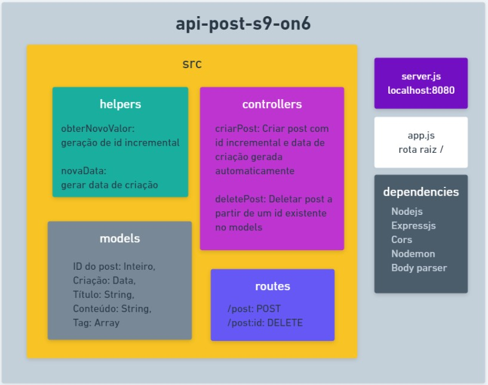

# Tarefas

### Blog da {reprograma}

O projeto é destinado para criar um novo post ou deletar já existentes a partir do id, utilizando boas práticas e estrutura de pastas, seguindo o design MVC. 

# Motivação

Aprender os conceitos de POST e DELETE, integrantes dos métodos HTTP.

# Arquitetura 

# Ferramentas utilizadas

* Nodejs
* Expressjs
* Cors
* Nodemon